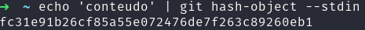
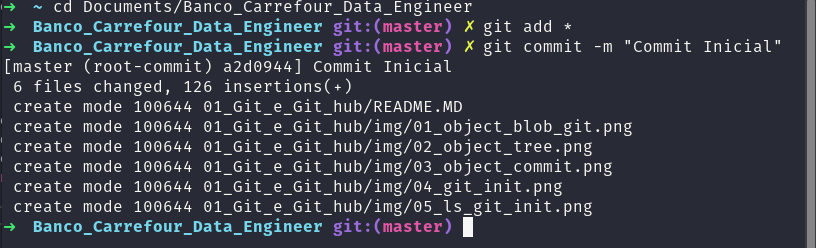

# GIT E GITHUB

## GUI X CLI

- **CLI:** Comand Line Interface
- **GUI:** Grafic User Interface

>  **Golden tip:** O git é um sistema CLI, ele foi projetado por comando em terminal.


### Comandos Iniciais:

Windows   |           Unix    | Descricao do comando |
--------- | ----------------- | ---------------------|
  cd      |     cd            |    Navegar           |
  dir     |     ls            |    Listar            |
  mkdir   |  mkdir            |   Criar pasta        |
 del/rmdir|  rm -rf           |   Remover pasta      |
 cls      |  clear  ou crl+L  |   Limpar terminal    |
 
 > **Golden tip:**  Usar o tab para auto-completar


### Instalando o Git

Apos instalar deverá configurar o git dentro do terminal, criar um usuário e e-mail conforme abaixo: 

```Bash
git config --global user.name "Pedro Lourenço" 
git config --global user.email "dataeng.pedrolourenco@gmail.com"
```
<hr>

## Entendendo o Git por baixo dos panos:

### SHA1:

A sigla SHA significa Secure Hash Algorithm (Algoritimo de Hash Seguro), é um conjunto de funções hash criptográficas projetadas pela NSA (Agência de Segurança Nacional dos EUA)

Nos dados que criamos, a encriptação gera conjunto de characteres indentificados de 40 digitos único.

> **Golden tip:**  Cada alteração no arquivo gera uma chave de characteres única.


### Objetos Fundamentais:

Os três tipos básicos dos objetos do git, que realizam os versionamentos 


- **Blobls:**

O git ele armazena os dados dentro do blob, ou seja o blob é um local de armazenamento de metadados

ou seja o blob ele é o nome do Objeto "blob" + o tamanho do arquivo + uma contra barra + zero + conteúdo do arquivo. Exemplo: 

```bash
'blob 9\0conteudo`
```

Exemplo: Pegando uma string e passando o output para o git, usando o hash. Ou seja vai retornar o SHA1 dessa string.

```bash
echo 'conteudo' | git hash-object --stdin
```



> Ou seja o git ele gerará um SHA1 e também armazena metada dados dentro de blobs


- **Trees:** 

O tree, ele armazema um ou mais blobs. No caso da arvore ela guarda tanto o sha1 do conteudo como os blobs armazena, e também o nome dos arquivos. 

> Golden Tip: Um arvora não aponta somente para blobs mas também aponta para outras arvores. 

Assim como o blob tem o sha1 ela também tem um sha1, ou seja se um arquivo mudar em um blob que esta dentro de um sha1 muda também da árvolre e etc!

**Diagrama Trees git**


> Imagem acima tirada da documentação do git

- **Commits:**

O commit é um dos objetos mais importantes do git pois ele é que irá juntar tudo, ou seja ele aponta para uma tree, ou para um parente(último commit realizado dentro dele), ele aponta também para um autor (quem é que commitou) e aponta para a menssagem (escrita que dará significado ao monte de arquivo que esta dentro desses commit), além disso vai junto um timestamp (ou seja um carimbo do tempo que foi realizado)

Lembrando que o commit também tem um SHA1, ou seja se eu alterar uma blob vai alterar o sha1 dele, que altera as trees e por ai vai, isso significa que o commit vai alterar o sha1 dele.

Ou seja você consegue montar a linha do tempo com suas chaves sha1 criptografadas.

**Diagrama Commit git**


> Imagem acima tirada da documentação do git

<hr>

## Primeiros comandos com git

- **git init:** Iniciar o git
- **git add:** Adicionar arquivos, o mover pasta
- **git commit:** Irá commitar

### Inicializando o arquivo:

```bash
git init
```


Se observarmos ele cria uma pasta oculta chamada git, por isso o ponto antes.

Se quisermos ver as pastas e arquivos ocultos conseguimos ver com o comando ls + a flag a conforme abaixo:

```bash
ls -a
```
**Exemplo:** se olharmos o comando ls acima não traz a pasta de configurações do git, porém em seguida usei o ls com a flag a e trouxe a pasta oculta dentro.


Para conseguirmos adicionar todos os itens da pasta vou usar git add * o asterisco significa "all"

```bash
git add *
```

Depois iremos commitar com git commit e escrever um texto dentro para deixar salvo o que é aquele commit.

```bash
git commit -m "Commit Inicial"
```


Se observarmos na imgagem ele trás alguns caracteres, esses são os inicios do SHA1 no caso desse commit é: **a2d0944**

<hr>

## CICLO DE VIDA DOS ARQUIVOS NO GIT

O git init inicamos o git e estamos também criando um repositório do git dentro da pasta X ou Y 

#### Tracked e Untracked

Tracked: Git tem ciencia dele.
Untracked: O git ainda não tem ciencia dele.


**Untracked:**

Quando damos o git add pegamos o arquivo X que estamos adicionando e jogamos ele para staged, ou seja tudo que esta na staged ele está aguardando o commit. 

**Unmodified:**

Nessa etapa onde estão os arquivos não modificados ou seja, que foi realizado o commit e que não tiveram alteração. 

Caso pegamos um arquivo que já tenha sido commitado, e modificarmos ele automáticamente o git compara as chaves SHA1 e ve que a chave foi alterada e isso informa para o git que o arquivo foi modificado entrão ele joga esse arquivo na área de Modified.

**Modified:**

Nessa etapa é onde os arquivos mudam de status de unmodified para modified quando o git enxerga que a chave SHA1 alterou.

Então ele fica aguardando o git add, para adicionar essa alteração dentro da staged; 

> Obs. Quando removemos o arquivo o arquivo excluido vira untracked ou seja o git para de exergar aquele arquivo. 

#### Ambientes 

Existem dois principais ambientes no git, o servidor onde está o "Remote Repository" um exemplo é o github. 

E existe o ambiente de desenvolvimento, onde encontramos três principais áreas, o Working Directory, a Stage Area e o Local Repository. 

Ou seja quando jogamos por exemplo para o github, estamos pegando o local repository para o servidor remoto. 

<hr>

## Github
